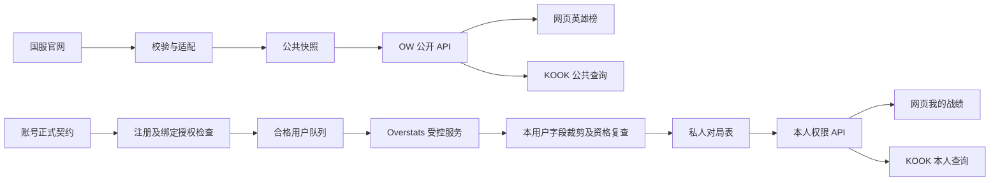

# OW 施工蓝图

版本：规划 v1，2026-10-08。数据库和生产 API 仍为拟实施内容。最初本轮只授权计划持久化；后续用户已启动基础网页 demo，最新范围与实际状态以 `DEMO_V1.md` 为准。

## 1. 结构与施工位置

| 已有位置 | 已核对现状 / 施工原则 |
|---|---|
| `site/src/CommunityApp.vue` | 单文件主站、查询参数路由、CS2 类型/视图；先加游戏外壳，必要时提取 CS2，保留 DOM/CSS/接口行为 |
| `site/src/community.css` | 黑金全局样式；OW CSS 独立作用域，不重做 CS2 |
| `site/src/main.ts` | 保留 Vue/Vite 结构，无必要不增加重型路由依赖 |
| `site/vite.config.ts` | 资源 `site-static` 和 API 代理；避免与后端 `/assets/` 冲突 |
| `deploy/nginx.conf` | 根目录无 SPA fallback；首版保留查询参数路径 |
| `TrashBox-Server/Backend` | 独立 FastAPI / SQLAlchemy / PostgreSQL 仓库；施工前核实工作树/分支 |
| `web/` / `game/` | Radar / Sniper 独立，本任务不改 |
| `miniprogram/` | 禁止修改，不新增 OW 能力 |

后端只读核对位置是 `/Users/lucas/Develop/project/TrashBox-Server/Backend`，不在当前前端工作树内。不能只改前端就称完成采集，也不能静默修改独立仓库分支。

拟新增前端模块：

```text
site/src/components/GameNavigation.vue
site/src/navigation.ts                   # 游戏维度、旧链接兼容
site/src/features/cs2/                   # 按需提取，不改统计合同
site/src/features/ow/
  OwSection.vue
  OwHeroBoard.vue
  OwHeroDetail.vue
  OwRecentChanges.vue
  OwMyMatches.vue / OwMatchDetail.vue     # P4 后才实现
  api.ts / types.ts / ow.css
  components/
    HeroPortrait.vue / HeroChangeBadges.vue / OwFilters.vue / DataFreshness.vue
```

后端遵守现有模块习惯，拟新增 `routers/ow.py`、`services/ow_armory.py`、`services/ow_overstats.py`、`services/ow_access.py`、独立采集脚本/worker 与 PostgreSQL `migrations/*_ow_{up,down}.sql`。KOOK adapter 仓库和目录待确定，不虚构已有入口。

## 2. 数据通道



官网通道不查询玩家；私人样本不代表国服整体。Overstats 不接受浏览器自行指定目标。

## 3. 数据库提案

| 公共表 | 关键内容 / 唯一性 |
|---|---|
| `ow_heroes` | 本地 hero key、官方 ID、名称、catalog 职责、头像引用；源 ID 唯一 |
| `ow_source_meta` | 来源/赛季命名空间、可用维度、schema/元数据版本与 hash |
| `ow_ingest_runs` | 每次任务、维度、结果、耗时、计数、脱敏错误、成功 batch 引用 |
| `ow_hero_stat_batches` | source/region/season/mode/tier/source_date、抓取时间、hash、修订号；同维度/日期/hash 幂等 |
| `ow_hero_stats_snapshots` | batch + hero 唯一、统计职责、四项源指标、公开原始行 |
| `ow_hero_adjustments` | 标签修订 + hero + label 唯一、官方 patch_date；允许多标签 |
| `ow_asset_manifest` | 资源来源/类型/URL/hash/版本/缓存位置/使用范围状态 |

同批事务入库，校验成功才发布该维度有效 batch。重复响应只记运行，不增快照；同日期源修订保留版本，读取取最新成功修订。趋势每来源日期/维度只取一份有效修订，不把多次轮询画成多天。

英雄数动态校验，未知 ID 保存并降级 metadata；非法数值、重复 ID、混合日期不能覆盖有效数据。catalog / stats 职责冲突单独记录。百分比保留源小数并校验 0–100，KDA 非负或 null；抓取时间存 UTC，显示/调度用 Asia/Shanghai；未知样本量不推算。仅新增 OW PostgreSQL 表，不改 CS2 `daily` / `server_avg_stats`。现有 Radar migration 有 MySQL 语法，不能复制。

私人表在账号契约后定稿：

- `ow_user_bindings`：owner、provider/region、已验证源 ID、显示 BattleTag、状态；绑定是否归账号服务所有待交接，不能重复建两套。
- `ow_collection_consents`：开启/撤销与权限版本；分享授权独立。
- `ow_player_snapshots`：仅目标用户允许字段的个人快照。
- `ow_matches`：本地 ID、owner/binding、源 match ID、源赛季命名空间、时间、地图/模式/结果/必要比分；`binding + source_match_id` 唯一。
- `ow_match_hero_stats`：本用户实测英雄粒度指标，不能凭总量拆分多英雄。
- `ow_user_sync_state`：游标/覆盖范围、状态、权限版本、最后成功、脱敏错误和退避时间。

owner 正式类型及外键由账号会话交付；当前 `users.uuid` 可能是微信 OpenID，不能写死 PostgreSQL UUID。两名注册用户同局也分别保存各自授权指标，不创建公开全员模型。

## 4. 自家 API 提案

公开前缀 `/api/v1/ow`，只返回校验后的数据与 metadata，不把上游响应直接作为前端合同：

| 接口 | 内容 |
|---|---|
| `GET /meta` | 可用赛季/模式/段位、数据日期、最后成功同步、支持能力 |
| `GET /heroes` | 英雄 metadata 和头像引用，不含玩家 |
| `GET /hero-stats?season=...&mode=...&tier=...` | 一个筛选 batch 的指标和来源/stale/schema |
| `GET /heroes/{hero_key}/history?...` | 实际积累的可比快照，无伪造每日增量 |
| `GET /adjustments` | 标签集合、来源日期/链接与修订 |

私人前缀拟为 `/api/v1/me/ow`：`GET /status`、`GET /profile`、`GET /matches`、`GET /matches/{local_id}`、`POST /sync`、`POST /sync-consent`、`DELETE /sync-consent`。绑定复用账号服务正式合同。

owner 从可信服务端登录态取得，不能由请求 `user_id` 指定他人；local match ID 仍检查所有权。刷新只限速入队。公开 metadata 至少含 source/region/源赛季/mode/tier、source_date/fetched_at/last_success_at/stale/revision，以及指标 unit/applicable。`ow/api.ts` 使用自家合同，不改 CS2 API。上游故障读最后有效快照；没有快照时明确不可用。

## 5. 账号会话交接需求

以下尚未交付，不代表另一会话已完成；当前不向该会话发送消息。

| 能力 | OW 所需保证 |
|---|---|
| principal | 稳定 owner、可信登录态、有效注册/注销/禁用状态 |
| 本人 OW 国服绑定 | provider/region/稳定源 ID、验证方式/时间；知道 BattleTag 或查到资料不是所有权证明 |
| 同步授权 | owner/binding/允许采集/权限版本，撤销/解绑/注销事件 |
| KOOK 映射 | 经验证 provider subject → owner，不能按群昵称匹配 |
| 可见性与删除 | 默认本人、显式分享、注销/撤销后的删除及保留期限 |

资格在入队前、worker 请求前、响应入库前复查，权限版本防在途竞态。撤销停采并清等待任务，过期响应不得写入/展示。账号服务不可用时私人采集保持关闭，公共榜继续。

服务凭据后端受控保存，不代表目标所有权。必要 `customer_token` 只存服务端受控缓存，不进 URL/前端/文档；队列只能由合格绑定生成，不能自由搜索玩家。

固定 Overstats 版本并关闭不受白名单约束的自动存档/采集；仅内网或回环暴露。裁剪后才进入自家缓存/日志/数据库，禁止整局原始 payload、其他参与者目录和未裁剪渲染图片。即使其他参与者已注册，也不能绕过其本人授权顺带采集。

## 6. 阶段与验收

### P0：计划持久化（本轮）

- [x] 核对源码、官网指标/标签/素材，记录已知异常与未验证事项。
- [x] `.Agent` 持久化历史、设计、蓝图和来源；根 `AGENTS.md` 指向入口。
- 业务实现、建表、采集和发布均未开始，不属于 P0。

### P1：公共数据与资源

依赖：用户启动施工，选定后端工作树及独立 PostgreSQL 测试库。

实现动态 `/index`、配置和竞技/快速 adapter，其他段位逐项验证，角斗默认关闭；新增公共表、幂等/修订采集命令、头像 manifest / 占位。初定每天北京时间 10:15 刷新；网络失败最多 3 次退避，非法参数不盲重试。这里仅计划调度，不在 P0 创建 automation。

验收：同响应重放不增快照，修订可追溯；业务失败/不完整批次/失联不覆盖有效数据；百分比不重复乘 100；双标签、职责冲突和未知英雄正确；隔离库验证 PostgreSQL up/down。现有 `serve-local.sh` 连服务器库，不能直接用于迁移/写入测试。

### P2：公开 API 与网页首版

实现公开接口、游戏导航、OW 榜单/详情/近期调整、作用域主题与头像；CS2 只作必要提取并保持原合同。

验收：`site` 类型检查/构建；真实浏览器 1280/390/360px QA；后退/前进/刷新恢复筛选；CS2 旧 URL、排行/玩家/社区/反应测试可用，搜索/指标/头像不串用；来源日期、快速禁用率“不适用”、旧 patch 日期、空态/stale 正确；`git diff` 无 `miniprogram/` 修改。

### P3：真实历史

基于积累快照增加趋势和修订读取；详细补丁仅在精确映射后接入。验收：无历史不制造曲线；不平均不同段位比例，不将涨跌解释为增强/削弱；跨赛季和修订边界正确。

### P4：注册用户 Overstats 试点

依赖：正式账号契约、受控服务/凭据、一名合格且明确授权的注册测试用户。P1–P3 可先交付。

验证本人绑定、响应语义、多英雄/赛季/分页/历史范围；关闭第三方自动存档，实现资格闸门、裁剪、私人表、同步/撤销及我的战绩。验收：未注册/无绑定/未授权/撤销/跨用户请求被拒；篡改 BattleTag 不增目标；他人身份不入任何持久层；对局幂等；在途撤销不落库；令牌失效不删除有效记录或泄露秘密。测试仅隔离库和授权样本。

### P5：KOOK 服务

公共英雄/调整命令依赖 P2 读取 API 与机器人实际仓库，不依赖用户账号映射，可与 P3/P4 并行。个人命令另依赖 P4 和经验证的 KOOK 身份合同；本人默认私信，未开启订阅不推送。

验收：复用同一数据与权限层，公共回复携带来源日期；群昵称不能绑定或查询个人数据；消息在测试空间验证，P0 不发消息。

### 发布与回滚（各通道独立）

公开 OW 网页完成 P2 验收后即可作为首版发布，P3 历史增强可后续追加；不等待账号、Overstats 或 KOOK。私人网页待 P4 独立验收，KOOK 公共和个人命令也分别发布。

上线前核对服务器、迁移/备份/恢复和开关。公共板块/私人采集独立启停，失败可关 OW 导航/worker，不回退 CS2 数据。迁移与发布在获得对应授权后实施；真实访问 `trashbox.tech` 核对入口、API、头像、刷新和 worker 才能称上线。

## 7. 当前待交付

- [ ] 后端工作树、隔离测试库。
- [ ] 官方指标定义/样本量、角斗维度、职责冲突澄清。
- [ ] 素材使用/缓存方式、装饰资源响应验收、标签到详细补丁映射。
- [ ] principal、本人游戏绑定、授权/生命周期、KOOK 合同。
- [ ] Overstats 版本/持久化开关/授权样本及私人存量删除期限。

每阶段更新实际路径、状态与验证证据；新增或取代决定记入 DECISIONS。清单勾选不能替代运行、浏览器或生产证据。
