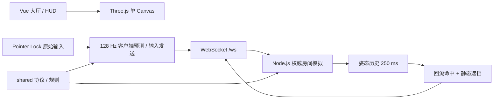

# BLACKLINE / 狙击突围训练 v1

独立于仓库现有 Radar 前端的桌面浏览器多人训练游戏。一个 Node.js 进程同时提供 Vite 构建产物、`/ws` 与 `/healthz`；房间状态仅存内存，v1 只支持单实例。

## 当前实现

- 2–5 人私人房、6 位房间码、全员准备、每人依次担任狙击手。
- 56×12 米固定夜间工业地图，三条紧凑可交叉路线；普通掩体严格限制为人物宽度的 1–1.8 倍、高度为 1.25–2.7 米。
- 128 Hz 权威模拟、输入和状态快照，自身预测/校正、45–100 ms 自适应远端插值、最多 200 ms 受限回溯；慢连接会丢弃可替代的旧快照，避免延迟堆积。
- Pointer Lock 原始鼠标输入优先；DPI、CS2 灵敏度、开镜灵敏度、eDPI 与 cm/360 校准。
- 栓动狙击枪状态：固定射击位、两档开镜、5 发弹匣、装填、1.455 秒射击周期、本地枪声/后坐即时反馈。
- 100 HP 统一伤害池：头部 100、躯干 55、四肢 45；保留独立命中区、断肢碰撞移除与伤残移动限制。
- 本地及远端距离衰减脚步声，静步和蹲伏具有更低音量与更长步频。
- 断线席位保留 15 秒；士兵未重连判失败，狙击手断线暂停，超时后存活士兵判突围。
- 回合与比赛结算按计划中的决胜顺序排序。

> `CS2_AWP_2026_08` 是可审计的校准快照，不代表 Valve 官方实现。数学映射与状态机已自动测试；本地游戏数据校对和三名熟练 AWP 玩家签字仍是严格训练认证的发布门槛，详见 [CALIBRATION.md](./CALIBRATION.md)。

## 本地运行

要求 Node.js 22+、pnpm 11+，建议桌面 Chrome 或 Edge。

```bash
cd game
pnpm install
pnpm dev
```

- 客户端：`http://localhost:5174`
- 权威服务器：`http://localhost:8080`
- 健康检查：`http://localhost:8080/healthz`

首次进入会显示内容提示。创建房间后复制邀请链接；至少两人且全员准备后，房主可启动训练。

## 操作

| 输入 | 行为 |
| --- | --- |
| `W A S D` | 移动 |
| `Shift` | 静步 |
| `C` / `Ctrl` | 蹲伏 / 双腿伤残时爬行；浏览器不支持键盘锁定时优先使用 `C`，避免 `Ctrl+W` 关闭标签页 |
| `Space` | 跳跃（伤势允许时） |
| 鼠标左键 | 狙击手射击 |
| 鼠标右键 | 1 倍镜 / 2 倍镜 / 退出开镜 |
| `R` | 装填 |
| `Esc` | 释放鼠标 / 退出全屏（浏览器保留行为） |

## 架构



工作区：

- `packages/shared`：协议类型、地图常量、伤残/计分规则、确定性移动。
- `packages/server`：房间、角色轮换、权威模拟、回溯命中、静态文件与 WebSocket 服务。
- `packages/client`：Vue 界面、Three.js 场景、输入、预测、HUD 与视觉特效。

客户端从不上报命中结果。它只发送输入、开镜/装填意图和射击命令；伤害、断肢、死亡与计分均由服务器广播确认。

## 验证

```bash
pnpm typecheck
pnpm test
pnpm build
```

测试覆盖灵敏度/FOV、100 HP 混合伤害、伤残组合、计分排序、128 Hz 移动、固定狙击位、掩体尺寸约束、确定性误差、遮挡、五客户端满房、重连与完整角色轮换。

## 生产部署

生产用仓库根目录 `./serve.sh`：主站和 Radar 发布到 `.serve-public/` 供 Nginx 直接读取；只有 Sniper Node 监听 `127.0.0.1:8003`。

| 路径 | 提供方式 |
| --- | --- |
| `/` | Nginx 静态文件 |
| `/radar/` | Nginx 静态文件（`RADAR_BASE_PATH=/radar`） |
| `/game/sniper/` | Sniper Node（`SNIPER_BASE_PATH=/game/sniper`） |

```bash
# 仓库根目录，一键发布并启动
cp -n .env.example .env   # 填写 DOMAIN=你的域名
./serve.sh restart
```

首次部署时，把 `deploy/nginx.conf` 中的仓库绝对路径替换后贴进现有 HTTPS `server`，然后执行 `nginx -t && nginx -s reload`。以后更新代码只需 `./serve.sh restart`，静态文件变化不需要 reload Nginx。安全组只开放 80/443，8003 保持回环监听。

```bash
curl http://127.0.0.1:8003/healthz
curl -I http://127.0.0.1:8003/game/sniper/
```

完整首次部署、权限和更新注意事项见仓库根目录 `deploy/README.md`。

v1 的房间和重连令牌只存在当前进程内：不要开启多副本，不要让反向代理在多个进程间轮询。空房间 10 分钟销毁，服务重启会结束所有房间。

可选 Docker 路径：`docker compose up --build -d`，同样需要在构建参数里传入 `BASE_PATH`，并只把容器端口绑到本机回环。

## 内容与资源

当前可玩场景使用原创程序化几何、Web Audio 合成音效和项目专用分享封面。精细模型、动画、PBR 材质和 CC0 音效候选尚未打包，避免在完成切分、重定向、压缩和逐项许可证复核前把第三方内容带入分发包。完整清单见 [ATTRIBUTION.md](./ATTRIBUTION.md)。

本项目不使用 CS2 标志、地图、角色、武器模型、贴图或原始音频。“CS2 手感预设，非 Valve 官方产品”。
